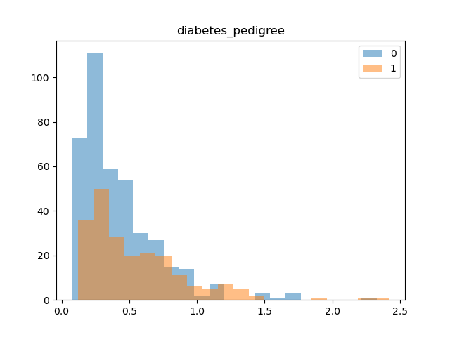

# Miniporject Report

## 資料集特徵資料說明、屬性特性說明

-   **p_id**
    -   Nominal
-   **no_times_pregnant**: Number of times pregnant
    -   Ratio
-   **glucose_concentration**: Plasma glucose concentration a 2 hours in an oral glucose tolerance test
    -   Ratio
-   **blood_pressure**: Diastolic blood pressure (mm Hg)
    -   Ratio
-   **skin_fold_thickness**: Triceps skin fold thickness (mm)
    -   Ratio
-   **serum_insulin**: 2-Hour serum insulin (mu U/ml)
    -   Ratio
-   **bmi**: Body mass index (weight in kg/(height in m)^2)
    -   Ratio
-   **diabetes pedigree**: Diabetes pedigree function
    -   Interval
-   **age**: Age (years)
    -   Interval
-   **Class variable**: Class variable (0 or 1)
    -   Nominal

## 對特徵做甚麼樣的分析? 哪些前處理? 採用哪些特徵? 原因?

首先，我先將各 feature 的分布畫出來，並依據 diabetes 的分類去觀察資料集特徵分佈。

再來，我觀察到有部分的資料 0 的數量是明顯偏多的，並且我也在測試資料觀察到這類的情況，因此我移除了 blood_pressure skin_fold_thickness serum_insulin 三個 feature，必免過多的 0 使模型歪斜。

## 基於什麼理由選擇哪個分類器?

我選擇使用隨機森林作為我的分類器，原因如下：

1. 這是一個高維的資料集，因此 Nearest-Neighbor classifiers 較不適用
2. Bayesian Classifiers 泛化性通常較低，因此不考慮
3. 單一的 Decision Tree 容易有 overfitting 的問題
4. Support Vector Machines 需要較多的預處理，調參上可能容易遇到困難
5. Artificial Neural Network 較難在 sklearn 復現，就算是線型模型，他的可解釋性也較差（並且我自己亂試的結果也沒想像中好）。

總合以上條件，我認為 隨機森林 或許是一個好的模型，並且支援高維特徵，也不需大量的預處理，泛化能力也不錯，並且此資料集也不大，也彌補了隨機森林耗時的缺點。

## 採用的評估指標結果與觀察

我使用 10-fold vaildiation 作為評估我模型的方法。
我的模型使用了 300 個決策樹，並且將 random_state 設為 0，並且使用 10-fold vaildiation 去找尋最適合的 max_depth，找尋的結果為當 max_depth = 8 時效果最好，其 test loss 為 0.775171866737176，並將此作為我的預測模型。
。

## 將預測結果上傳至 kaggle 並截圖測試的分數

最終結果為 0.74675

